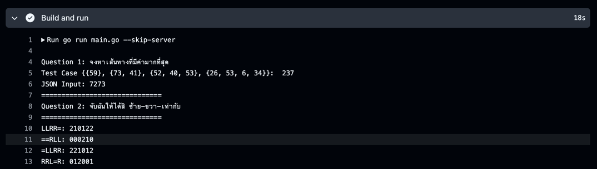

## 📙 Seven Hunter Assignment

### 📍 ข้อ 1-2 
- สามารถดู code ที่เขียนได้ที่ `/question-1/question-1.go` และ `/question-2/question-2.go` สามารถดู result ได้โดยจะรันผ่านไฟล์ `go run main.go --skip-server` หรือสามารถกดเข้าไปดูใน pipeline ของ github action ก็ได้เหมือนกันนะครับ ;-;


### 📍ข้อ 3
ในส่วนของข้อ 3 สามารถ setup project เพื่อรันดูได้เลยครับ หรือสามารถลองยิงแบบเร็ว ๆ ได้ที่

- Link for production
  - API https://seven-hunter-http.tongla.dev/beef/summary
  - GRPC `34.126.83.199:50051` โดยใช้ proto spec ตาม section `Setup project with docker`

### 📍 Dependencies
- ✅ golang v.1.24
- 📄 หรือสามารถรัน project ผ่าน docker-compose ได้ครับ 

### 📁 Setup project with docker
- run project with docker
```bash
    1: 📄 docker compose build
    2: 📄 docker compose up -d
```
- 💡 Path API(http) http://localhost:8080/beef/summary
- 💡 Path GRPC localhost:50051 โดยใช้ proto spec ตามด้านล่างนี้เลยครับ
```protobuf
syntax = "proto3";
option go_package = "proto-gen/;proto";

package beef;

service Beef {
  rpc BeefSummary (BeefSummaryRequest) returns (BeefSummaryResponse);
}

message BeefSummaryRequest { }

message BeefItem {
  string name = 1;
  int64 count = 2;
}

message BeefSummaryResponse {
  repeated BeefItem beefs = 1;
}
```

Happy hacking kub :)

